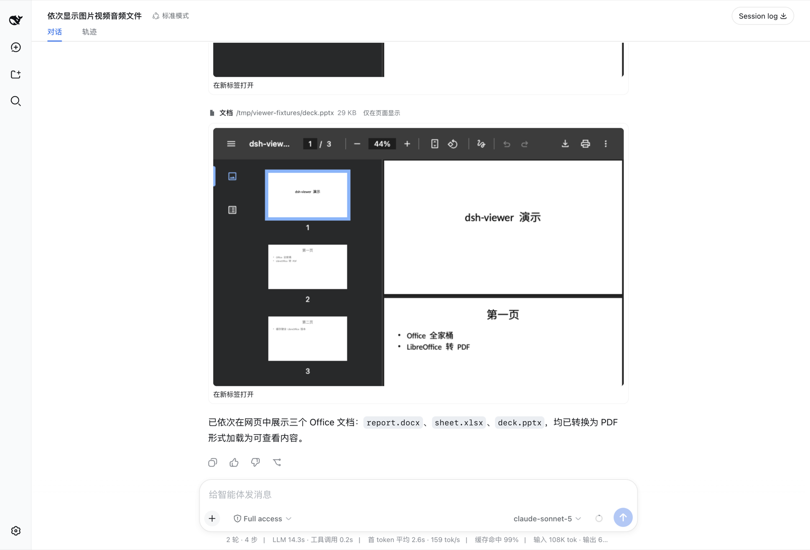
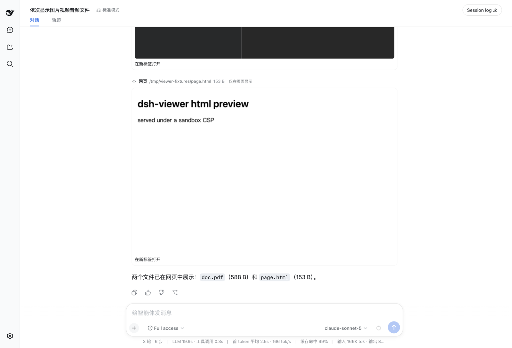

<div align="center">


# @crosery/dsh-viewer

**Everything renders.** One `display_file` tool that puts images, video, audio, PDF, Office documents and local web pages inline in the [DeepSeek Harness](https://github.com/deepseek-ai) conversation, on the web and in the desktop app — with a real player, not a filename and a byte count.

[English](README.md) · [中文](README.zh.md) · MIT

</div>

---

## What it does

The harness ships `read_image`, whose job is to put a picture into **model context**. It refuses on a text-only route, it handles four raster formats, and up to harness 0.1.2 the built-in web client draws no card for it — so the human in front of the screen sees one line of text. (From 0.1.3 the harness draws its own `read_image` view, and this plugin's card for that key steps aside.)

This plugin inverts that. Its job is to put a file **on your screen**. A text-only model route is a normal outcome, not a refusal, and every medium a browser can play is in scope.

**36 file extensions across 6 render kinds:**

| Kind | Element | Extensions |
| --- | --- | --- |
| Image | `` + click-to-zoom lightbox | `png` `jpg` `jpeg` `webp` `gif` `svg` `avif` `bmp` `ico` `apng` |
| Video | `<video controls>`, seekable | `mp4` `m4v` `webm` `ogv` `mov` |
| Audio | `<audio controls>` | `mp3` `m4a` `aac` `wav` `flac` `ogg` `oga` `opus` |
| PDF | embedded viewer | `pdf` |
| Document | converted to PDF, embedded | `docx` `doc` `rtf` `odt` `xlsx` `xls` `ods` `pptx` `ppt` `odp` |
| Web page | sandboxed `<iframe>` | `html` `htm` |

Anything else still gets a card with its type, size and an open link — there is no kind that renders nothing.

On a model route that accepts image input, a `png` / `jpg` / `jpeg` / `webp` / `gif` **also** enters the model's own context, so one call both shows you the file and lets the model see it. Everything else is shown to you only, and the card says so.

## Screenshots

Images, video and audio in one turn — real players, real scrub bars:


Word, Excel and PowerPoint, converted on the host and embedded:



PDF and a local HTML page, live:



## Install

```sh
dsh plugin --profile web add github:crosery/dsh-viewer
```

Then add the package name to `dsh.profile.bundles` in your profile's `package.json` and **restart the profile** — bundle membership changes do not hot-reload.

The repository ships its built halves, so this needs no build step and no `allowBuilds` entry in your profile. The same code is attached to every release as a tarball if you prefer a pinned, versioned install:

```sh
dsh plugin --profile web add https://github.com/Crosery/dsh-viewer/releases/latest/download/dsh-viewer.tgz
```

**On the desktop app**, open **Plugins → Add plugin** and paste the release tarball URL above. The `dsh` CLI refuses the desktop profile (`profile "desktop" is managed exclusively by the Electron application`), so this is the only way in. Upgrading an installed plugin there needs an app restart.

**Harness 0.1.7 — the desktop app included — needs 0.2.0 or later.** From 0.1.7 the harness checks a plugin's peer ranges itself, and v0.1.1's ranges stop below 0.1.6: installing it is refused, and an already-installed copy is skipped at boot without a word — the chat works, and nothing is ever displayed.

Office rendering needs a converter. From harness 0.1.6-alpha.2 on — the desktop app included — the harness's own bundled converter handles `doc` `docx` `xls` `xlsx` `ppt` `pptx` with nothing else installed. `rtf` and the OpenDocument trio, and every format on older trains, need LibreOffice on `PATH` (or the macOS app bundle):

```sh
brew install --cask libreoffice     # macOS
```

Without a converter, every other format still works and a document card says exactly what is missing.

Converted PDFs are cached in `$DSH_HOME/.dsh-viewer-cache/`, shared by every profile, so a document converts once per edit rather than once per display. The cache is bounded: an artifact unused for 30 days is removed, and beyond 256 documents or 512 MiB the least recently used go first. Serving a card's PDF counts as a use.

## How the bytes reach the page

Two channels, in priority order.

**A signed HTTP route** (`/crosery/dsh-viewer/asset`) streams from the host. It is the only channel that can carry video, audio, PDF or HTML, and the only one that supports range requests — which is what makes a `<video>` seekable at all.

**The durable attachment store** is the fallback. Images only, but it is irreplaceable in two cases: a filesystem backend that exposes no local path (a remote workspace), and rendering a shipped `read_image` result, which has an attachment and no URL.

They are not redundant: a raster on a vision route still goes through the attachment store, because that is the only way it also reaches the model. From 0.1.7 durable images are read through the chat's own loader, which shares one read per image across the session.

In the desktop app, video and audio load from the Host's loopback address (`__DSH_TRANSPORT__.streamBaseUrl`) instead of the window's `dsh-app:` origin: the app's protocol forwarder drops `Content-Length`, and Chromium then treats the first load of a media URL as an unseekable stream. The route authorizes by signature, so nothing else changes.

## Security

The route **never accepts a path from the browser.** At tool time the host signs the resolved absolute path with a per-harness HMAC key; path and MAC travel together in the URL, and the route honours a path only after the MAC verifies.

- Key: 32 random bytes at `$DSH_HOME/.dsh-viewer-asset-key`, mode `0600`, generated on first use. A self-contained signature rather than an in-process token table, because cards must survive a restart — a card replayed from a months-old session log holds only the URL it was minted with. The one exception is a converted document: its URL names a cached PDF, and once that has been evicted the card's frame answers `404` until `display_file` converts the file again.
- Tampering with the path, swapping keys, dropping the signature, or re-spelling the base64 with padding all return `404`. "Not signed by us" and "signed but the file is gone" return the *same* status, so a probe cannot learn whether a file exists.
- `text/html` and `image/svg+xml` ship with a `Content-Security-Policy` (`sandbox` and `default-src 'none'` respectively): navigating directly to such an asset would otherwise run its script on the app's origin. Everything carries `X-Content-Type-Options: nosniff`.
- Bytes stream with `createReadStream`, not `ctx.fs.readBytes` — the latter materializes the whole file in memory, and a two-hour video is precisely the case this plugin exists for.

## Configuration

Four switches. Every default is the behaviour the plugin exists to provide; each flag gives one piece back.

| Field | Default | Turning it off |
| --- | --- | --- |
| `tool` | `true` | `display_file` is not registered at all |
| `redirectRead` | `true` | `read` may decode a raster into replacement characters again |
| `feedModel` | `true` | images are shown only, never added to model context |
| `supersedeReadImage` | `true` | the shipped `read_image` becomes visible to the model again |

Where to edit them depends on the harness train:

- **Up to 0.1.6**: the `crosery-viewer` section of `$DSH_HOME/settings.yaml` — hot-reloaded, no restart.
- **0.1.7 and later** (web and desktop): there is **no settings form** for this plugin. The Settings page builds forms only from fields a plugin marks volatile, and these are not. Set them on the plugin's `viewer` entry in the profile's own patch file, `$DSH_HOME/profiles/<profile>/cordis.patch.yml` — `~/.dsh/profiles/web/cordis.patch.yml` for `dsh --profile web`, `~/.dsh/profiles/desktop/cordis.patch.yml` for the desktop app — then restart the profile or the app:

  ```yaml
  - id: viewer
    config:
      redirectRead: false
  ```

  The row replaces the entry's `config` as a whole rather than merging into it, so a field it leaves out keeps its default. `settings.yaml` is gone on 0.1.7, and its one-time import moves each section into the entry of the same id, so a `crosery-viewer` section is **not** carried over — it stays behind in `settings.yaml.imported`.

## Design notes

**`read` on binary media is not an error.** The shipped filesystem provider samples the file head and throws `FS_NOT_TEXT` on a NUL byte, so `read` aimed at a PNG paints a red failure row with or without this plugin — for a file that exists and is one call away from being on screen. Neither obvious correction removes it: a `tools/pre-execute` denial materializes its own error, and a `tools/post-execute` decision cannot replace the value of a failed result. So the correction runs in the `tools/execute` around-dispatch waterfall and never calls `next()` — no filesystem I/O happens at all, and the authored success is re-projected through the owning tool's own `render` and `presentationMeta`, which replaces the persisted read metadata too. The result is an ordinary successful read whose one line points at `display_file`.

**Guidance that divides the work.** A short system-prompt section tells the model when to call `display_file`. It sits right after the shipped read guidance — order 101 up to 0.1.5, `getSectionOrder('TOOL_READ') + 1` from 0.1.7 — and is empty for an agent that cannot call the tool. Where the harness also offers `present`, it leaves deliverables to `present` and pictures inside an answer to markdown images, so one file is never displayed, embedded and presented at once.

**One image entry point.** `read_image` and `display_file` overlap on exactly one thing — putting a raster into model context — and a model offered both uses both. Measured on a real 2.2 MB PNG: the same image entered context twice in one turn. `display_file` is a strict superset, so `read_image` is hidden per agent via `tools.restrict()` on `agent/created`, retried on `tools/change` because the shipped tool registers behind an async service injection.

**Nested `run_code` calls get no `presentationMeta`.** The registry projects it only for top-level calls, so a `display_file` invoked from inside `run_code` would render as a bare header. The model-facing envelope therefore carries `<media>`, `<bytes>` and `<asset>` elements, and the card rebuilds from its own envelope when metadata is absent — validated through the same narrowing the replay path uses. The image of such a call reaches model context once: the code-mode transport already defers every child result that carries an image block, so the tool does not defer it again.

**Completed turns keep their files on screen.** From 0.1.6 the chat folds a completed turn's tool rows behind one "used N s" disclosure, and 0.1.7 does it by default. The plugin therefore also contributes to the chat's turn tail — the list between a turn's closing reply and its action row, where the harness's own delivery cards live — and shows that turn's displayed files there once the turn completes. That includes files displayed from inside `run_code`: those calls are logged as `tool/ptc-dispatch` events that carry no turn number, so they are collected when the turn ends, from where the conversation engine itself placed them. The tail stands down wherever the rows are visible anyway: the `verbose` transcript view, a turn that is still running, was aborted, or failed, and — on 0.1.7, whose chat keeps such a turn unfolded — a turn the user steered while it ran.

**The conversion cache survives restarts, and stays bounded.** The harness's bundled converter stamps each provider instance with a random `generation`, so keying artifacts on it made every restart a cold cache that was never hit again and only grew. The key is the converter's configuration instead — fonts, fallbacks, image resolution — plus the source's path, version and size: new settings are a new artifact, a restart is not. An engine upgrade under unchanged settings keeps serving the older render of the same bytes until it ages out. Pruning runs in the background at activation and after each write, and only ever removes regular files in the cache directory whose names the converters write.

**A PDF iframe must not be sandboxed.** `sandbox` without `allow-same-origin` gives an opaque origin, and Chrome's PDF viewer refuses to run there, showing "This page has been blocked by Chrome". Local HTML is the opposite case and keeps the sandbox.

## Development

```sh
npm install
npm run typecheck   # host and client are separate programs — see below
npm run build       # two .d.ts trees + two bundles; the result is committed
npm run check       # repo invariants: README counts, locale keys, peer range, install path
npm run check:dist  # the committed lib/ is byte-identical to a fresh build
npm test            # 146 cases
```

Two tsconfigs are required, not fastidiousness: both halves augment the same `@deepseek-ai/cordis` `Context`, and `sessions` is `SessionStore` on the host but `ISessions` in the browser. One program seeing both augmentations silently resolves the wrong one, because `skipLibCheck` hides the conflict.

`tests/asset-route.test.ts` mounts the handler on a real `node:http` server and issues real requests — range correctness cannot be proven by unit-testing the parser. `tests/convert.test.ts` builds a DOCX with LibreOffice, converts it back, and asserts the artifact starts with `%PDF-`.

## Harness compatibility

| Where | Versions | Evidence |
| --- | --- | --- |
| Web (`dsh --profile web`) | every published version from `0.1.0-rc.8` through `0.1.7-rc.2` — npm `latest` (`0.1.5-rc.3`), `next` (`0.1.7-rc.2`) and `alpha` (`0.1.7-alpha.2`) included | both typechecks and all 123 tests on each version; a boot smoke of the packed plugin on the newest version of every tuple, `0.1.0-rc.8` through `0.1.7-rc.2`, and on `0.1.7-alpha.2`; live in a browser on `0.1.7-rc.2` (v0.1.1 also on `0.1.1-rc.2` and `0.1.5-rc.2`) |
| Desktop app | `0.1.7-rc.2` — its only channel, `nightly` | the boot smoke on the app's own runtime; live in the desktop window on macOS |

The peer ranges admit exactly that support, under npm's semver rule and under the prerelease-inclusive rule the harness applies itself from 0.1.7. `0.0.1` and `0.1.0-rc.2` – `rc.7` predate a package the browser half needs, and the ranges refuse them; `0.1.8` and later are admitted once CI has verified them.

CI keeps the claim honest. Every pull request runs typecheck, tests, peer admission and a real boot of the packed plugin on the pinned train, on the `0.1.1-rc.2` floor and on whatever the desktop app ships that day. A daily job repeats that against the desktop app and npm's `latest`, `next` and `alpha`, and against the desktop zip itself on macOS. A weekly job sweeps every published harness version, so a new one shows up without anyone adding it. A failure opens an `upstream-drift` issue, and the first green run closes it. Releases are gated on the same checks. Details: [docs/harness-compatibility.md](docs/harness-compatibility.md).

## Known limitations

- Local file paths only; URLs are not accepted.
- Video and audio duration/resolution are not in the card header — that needs `ffprobe`. The player shows them.
- Where the plugin reads an attachment-only image itself (up to 0.1.5), the object URL lives until the plugin unloads, bounding held blobs by the distinct attachments displayed meanwhile. From 0.1.7 the chat's own loader owns them.
- On a remote workspace with no `processPath`, non-image media have no channel and the card says so.
- No transcoding: a codec the browser refuses (ProRes in a `.mov`) falls back to the `<video>` fallback text.
- In the desktop app, "Open in a new tab" becomes **Preview in sidebar** (the harness's own preview, PDF.js for PDFs): the desktop window silently refuses new tabs for app URLs. Everything inside the card — images, players, PDF and document frames — renders the same as on the web.
- The turn tail needs the list-shaped tail of 0.1.6+. On 0.1.2–0.1.5 a folded ("compact") completed turn keeps its cards inside the fold; switch the transcript view to `normal` there to keep them open. On 0.1.6 the `normal` view shows a card both in the turn and in its tail.
- If the user expands a folded turn, its displayed files appear twice — in their tool rows and in the tail — as the harness's own delivered files do.
- The tail recognizes a steered turn from the chat's own process anchor (its `turn-process` turn data). Should a future chat stop publishing that, a steered turn would show its cards twice — in its unfolded rows and in the tail — rather than lose them.

## License

MIT © Crosery
