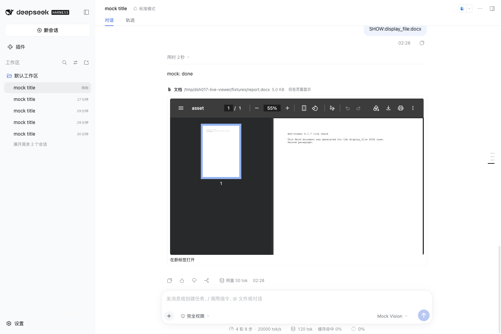
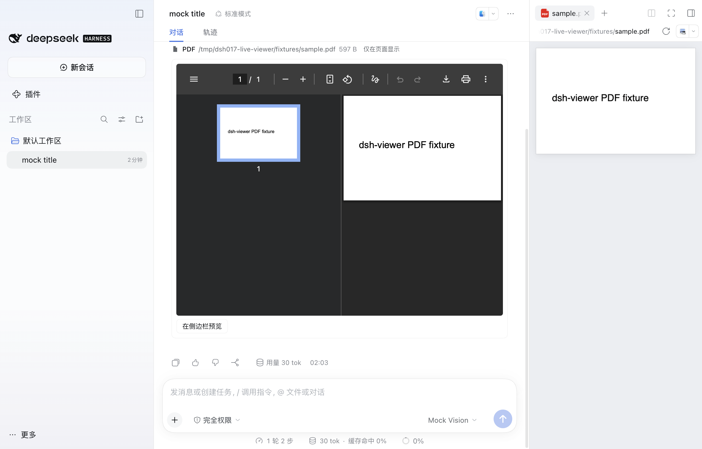
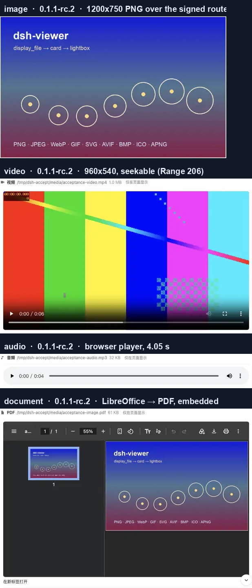
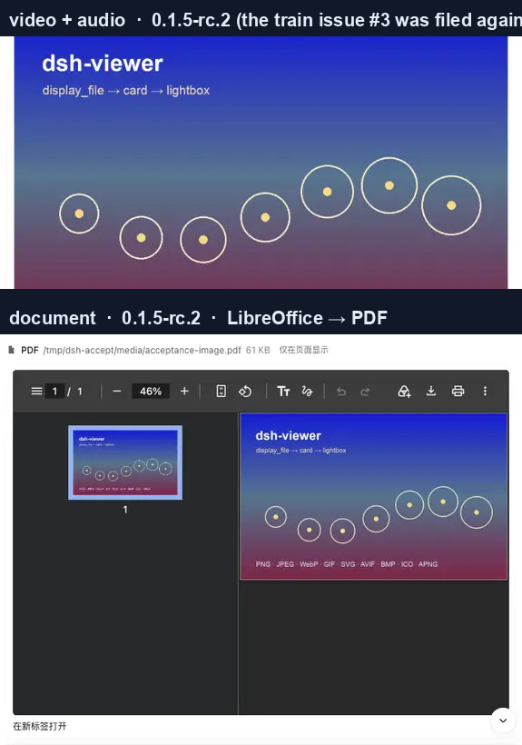

# Acceptance record

> **English** · [中文](acceptance.zh.md) · [Docs index](README.md)

What was verified end to end, on which harness versions, and how. Every number below came from a running host, not from reasoning about one. The v0.1.1 sections at the end are kept as the record of that release.

## 0.2.0: every published version

`node scripts/sweep-trains.mjs` repoints every `@deepseek-ai/dsh-*` devDependency of a scratch copy at one version, installs, and runs both typechecks and the whole suite. It does this for every published version. A version is **supported** when every harness package the plugin compiles against is published on it and all three checks pass.

| Versions | Outcome |
| --- | --- |
| `0.1.0-rc.8`, `0.1.1-rc.2`, `0.1.2-rc.1`, `0.1.3-alpha.2`, `0.1.5-rc.3`, `0.1.6-alpha.2`, `0.1.7-alpha.2`, `0.1.7-rc.1`, `0.1.7-rc.2` | supported: host tsc, client tsc and all tests pass |
| `0.1.1-rc.1`, `0.1.2-alpha.2` – `alpha.5`, `0.1.5-alpha.1`, `0.1.5-alpha.2`, `0.1.5-rc.1`, `0.1.5-rc.2`, `0.1.6-alpha.1`, `0.1.7-alpha.1` | supported: the same, installed through that version's own `@deepseek-ai/dsh`, because its caret peers make npm's peer graph stop with `ERESOLVE` |
| `0.1.0-rc.2`, `0.1.0-rc.3`, `0.1.0-rc.6`, `0.1.0-rc.7` | predates: `dsh-client-ui-renderer` is first published at `0.1.0-rc.8`; the peer ranges refuse them |
| `0.0.1-rc.1`, `0.0.1-rc.2`, `0.0.1-rc.5` | predates: `dsh-client-ui-renderer` (and on rc.1/rc.2 `dsh-home-paths`) not published yet; the peer ranges refuse them |

Every supported row ran all 123 tests, 123/123, in the final sweep on 2026-09-26. The exit status was 0.

The last v0.1.1 record called `0.1.2-alpha.5`, `0.1.5-alpha.1`, `0.1.5-alpha.2` and `0.1.5-rc.1` incoherent, on the evidence of npm's peer graph. The harness never runs that graph: `@deepseek-ai/dsh` pins every package it composes exactly. Installed the way the harness installs itself, all four pass.

## 0.2.0: boot smoke

`scripts/smoke-boot.mjs` packs the checkout and installs the tarball into a throwaway `DSH_HOME` with `dsh plugin --profile web add`, with no exemption. It then boots `dsh --profile web`, checks the startup audit, reads `__DSH_BOOT__` through the tokenized URL, and evaluates the served client bundle against the shell's own module table.

| Harness | How it was installed | Result |
| --- | --- | --- |
| `0.1.7-rc.2`, desktop app | the installed app's `Contents/Resources/app.asar/dsh`, run by its Electron binary with `ELECTRON_RUN_AS_NODE=1` (Node 24.18.1) and its bundled pnpm 11.7.0 | all 8 stages pass; 65 boot entries; a 9-specifier module table |
| `0.1.7-rc.2`, npm | `npm install` into a throwaway prefix on Node 24.21.0; it is the newest release, so today's graph is its release graph; pnpm 11.7.0 | all 8 stages pass; 65 boot entries; a 9-specifier module table |
| `0.1.1-rc.2`, npm | `npm install --before 2026-08-30T14:10:52.613Z` (as released) on Node 24.21.0; pnpm 11.7.0 | all 8 stages pass; 43 boot entries; a 7-specifier module table (no `dsh-client-store`, no dockkit) |
| `0.1.0-rc.8`, `0.1.2-rc.1`, `0.1.3-alpha.2`, `0.1.5-rc.3`, `0.1.6-alpha.2`, `0.1.7-alpha.2` — the newest version of every other tuple, and npm `latest` and `alpha` | `npm install --before <that version's release window>` on Node 24.21.0; pnpm 11.7.0 | all 8 stages pass on each; 43, 47, 49, 54, 59 and 63 boot entries; module tables of 7 (0.1.0), 8 (0.1.2, 0.1.3) and 9 specifiers |
| `0.1.7-rc.2`, desktop app, **released v0.1.1 tarball** | as above | **install refused**: `dsh: installation rejected: Plugin @crosery/dsh-viewer@0.1.1 is incompatible with dsh 0.1.7-rc.2: peerDependencies …`. This is the regression the smoke exists to catch |

`node scripts/harness-target.mjs desktop --admits` on v0.1.1's manifest fails the same way: all 10 harness peers refuse `0.1.7-rc.2` under both rules.

A fresh `npm i @deepseek-ai/dsh@0.1.1-rc.2` today resolves the cordis family to its 2026-09-22 releases (cordis 4.0.4, cordis-plugin-hmr 1.0.19, cordis-plugin-loader 1.0.5), and that harness does not boot even with no plugin at all: `dsh: user patch-layer watching requires the Cordis HMR service`. Resolved as of its release window instead (cordis 4.0.2, hmr 1.0.17, loader 1.0.3, the same set as the owner's everyday install), it boots. The smoke therefore installs each version with `npm install --before <the next release's publish time>`, moved later when one of the version's own packages was published after that: `0.1.5-rc.3`'s `dsh-client-ui-sidebar-documentpreview` appeared about seven hours after it, and after `0.1.7-alpha.1`, so before then `0.1.5-rc.3` could not be installed at all. `0.1.0-rc.8` serves its boot graph as `window.__DSH_BOOT__` instead of `globalThis["__DSH_BOOT__"]`; the smoke reads both.

npm's peer resolution for `0.1.1-rc.2` does not settle in reasonable time under npm 11; the GitHub floor cell spent 653 s there. The smoke now gives the plain install 120 s and then installs in legacy peer mode plus every unmet peer at its declared range. Rerun that way on 2026-09-26 (Node 24.21.0, npm 11), the floor passed all 8 stages: the plain install was cut off at 120 s, 21 unmet peers were added under the same `--before 2026-08-30T14:10:52.613Z`, 43 boot entries, a 7-specifier module table, 2 min 52 s in total. The same day `0.1.7-rc.2` passed all 8 stages installing a separately packed tarball through `--tarball`, and `scripts/release-notes.mjs` accepted the sha256 the smoke recorded for it: the release gate's path.

## 0.2.0 on 0.1.7-rc.2, live

Both hosts were isolated: their own `DSH_HOME`, a mock model provider that calls `display_file` on request, and the plugin installed from its packed tarball with the profile's `compatibility.json` set to `{}` (no exemption). The boot log had no `skipping profile bundle` and no `did not activate`. The browser console showed no errors or warnings, in particular no `read_image` slot collision.

### Web

| Property | Value |
| --- | --- |
| Completed turn | its tool rows fold; PNG, PDF, MP4 and DOCX cards show in the turn tail below the reply |
| `verbose` view | the inline card, no tail; back to standard, the tail returns |
| After a reload | the tail is rebuilt from the session log |
| DOCX | converted by the harness's bundled converter: the PDF's producer is `LibreOfficeDev 26.8.0.3`, the bundled kit, not the local LibreOffice 26.2.2.2 |
| Video | `currentTime` reaches 8–9 s, `seekable` `[0, 12]`, a Range request answers `206` with `Content-Range` |
| Lightbox | portalled to `body` with an `aria-label`; focus moves to the close button, Tab stays inside, Escape closes it without reaching the page's own listeners and returns focus to the thumbnail |
| System prompt | the `display_file` section sits directly after the read guidance, with the `present` clause |
| `read` on a PDF | redirected to `display_file` |

### Desktop app

A second, isolated instance of the desktop app (its own user-data directory, `DSH_HOME` and ports), next to the owner's running one, which was not touched.

| Property | Value |
| --- | --- |
| PDF | renders inline (`navigator.pdfViewerEnabled` is `true`); **Preview in sidebar** opens the harness's PDF.js preview |
| New-tab link | the window opens no window for `target=_blank`, which is why the card offers the sidebar instead |
| Video, before the fix | through the `dsh-app:` forwarder, which drops `Content-Length`, the first load is not seekable |
| Video, after the fix | loads from the Host's loopback address and reaches `t = 9`, `seekable` `[0, 12]` |
| DOCX | renders inline, with the sidebar button |

## v0.1.1 on 0.1.1 → 0.1.5

### Cards, on a live host

Both hosts were real `dsh --profile web` processes with their own `$DSH_HOME`, the plugin installed over the git channel, and a seeded session whose asset URLs were minted with that home's own HMAC key.

#### 0.1.1-rc.2

#### 0.1.5-rc.2 — the train issue #3 was filed against

This host did not start at all before the fix: the entry failed to load with `does not provide an export named 'installSettingsSection'`.

### Measurements

| Property | Value |
| --- | --- |
| Image card pixels | rendered `1200x750` from the source PNG |
| Card ↔ source correlation | `0.9958` (screenshot region vs the source file; 1.0 is identical) |
| Video | `960x540`, `6s`, `mediaError: null` |
| Seek | `currentTime 3.5s → 4.24s`, `buffered 0.00-6.00` — the range path, exercised from the player |
| Audio | `4.05s`, played from the same signed route |
| Range response | `HTTP 206` |
| Tampered signature | `HTTP 404` |
| `settings/describe` | `crosery-viewer` listed with its four fields and defaults |
| `settings/update` | `{tool: false}` → read back `user.tool: false`, `revision 1`; restore → `revision 2` |

## What this record does not claim

- **Windows.** The desktop app ships for `win-x64` too, and CI checks that its feed agrees with the macOS one, but nothing ran on Windows. The Linux evidence is CI's.
- **The desktop GUI in CI.** The `desktop-bytes` job boots the app's own runtime without a window. The Electron renderer, the preload bridge and native drag-and-drop were verified by hand, above, on macOS only.
- **A live browser check of 0.2.0 on 0.1.1-rc.2.** There, the evidence is typecheck, tests, a byte-identical build and the boot smoke; the live cards above are from v0.1.1.
- **Real attachment-only images through the chat's loader, and upstream's `read_image` view winning live.** Both are covered by unit tests against the real slot core only.
- **The card model's replay paths** (a session log written by an older build, a truncated window) are covered by unit tests, not by screenshots.
- **Live model turns.** A mock provider drove the 0.1.7 sessions and the v0.1.1 sessions were seeded, so nothing here depends on a model provider being reachable.
